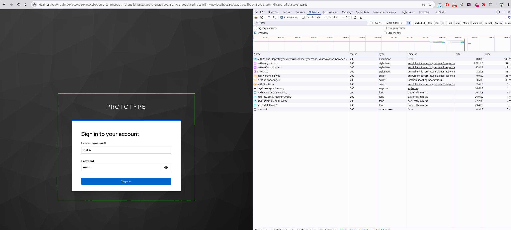
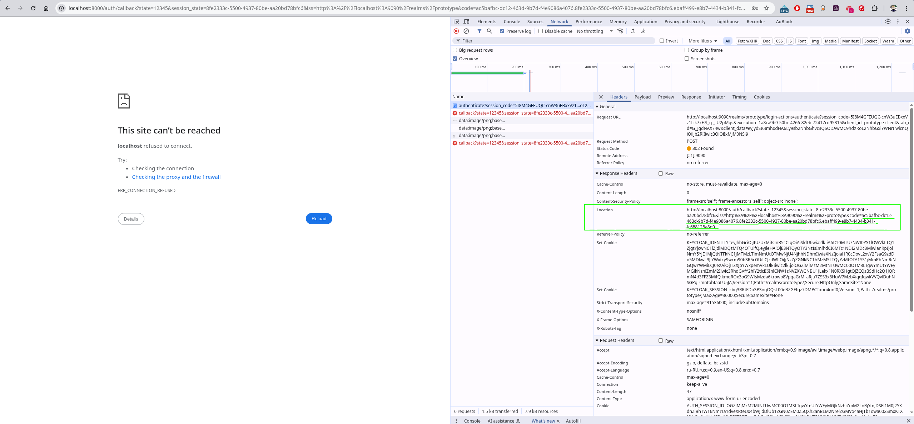
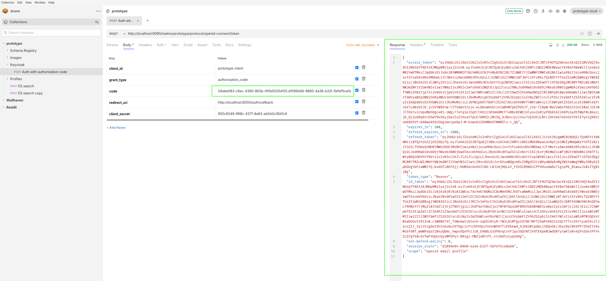

# Motivation
Boredom.
The first idea came to mind is a dating service. Why? Да хз.

# Backend
Currently consists of `core` service: 
* Postgres as a primary DB
* ElasticSearch: indexing and searching performance improvement
* Kafka to asynchronously index profiles being created

## Plans
* Core service extension with support for basic business features like profile editing, including photos uploading (CDN?)
* Spring Cloud Gateway based API Gateway (security, observability, underlying services scalability)
* Dedicated chatting service
* Observability (logging and tracing at least)

## Setup

### Run locally

1. Use `docker-compose.yml` from the root folder to setup local infrastructure. Run: `docker compose --profile all up`
2. Build and run core service
    1. Navigate `backend/core/core` folder
    2. Build service via `./mvnw clean package`
    3. Run it by executing `java -jar target/{path-to-executable-jar} --spring.profiles.active=local`
    4. Check out APIs (e.g. using Bruno collection from _etc/.bruno_ folder in the root of the project)
    5. Track results in DB, ES, Kafka (see [Local env URIs](#-local-env-uris) section)    
   
Makefile is to be done

### Authentication & authorization via Keycloak
Web UI is available at [localhost:9090](http://localhost:9090/). Credentials: `admin/password`.  
Backend database for the Keycloak is created in `postgres-prototype` container (see `etc/postgres/02_keycloak.sql`)
Following dev identity settings are provided with the **keycloak** container (take a look at `etc/docker/keycloak/init-sample.json`):  
* realm: `prototype`
* client_id: `prototype-client`
* client_secret: `950c9349-998c-437f-8a63-ab5d3c0841c6`
* allowed redirect URIs: ['http://localhost:8000/auth/callback']

To check Authorization Code Grant Type flow use following steps:
1. Open Authorization URL in a browser: http://localhost:9090/realms/prototype/protocol/openid-connect/auth?client_id=prototype-client&response_type=code&redirect_uri=http://localhost:8000/auth/callback&scope=openid%20profile&state=12345
2. Enter user credentials (for the admin: `Ins137/passw0rd`)

3. Take code from the network log (`Location` redirect response header):

4. Put it as the `code` parameter into "Keycloak/Auth with authorization code", perform POST x-www-form-urlencoded query:

# Frontend
One day maybe

# Local env URIs  
[ElasticVue](http://localhost:8085/)  
[Kafka Control Center](http://localhost:9021/)

# Important note
I've got another username, which've I used in a couple of commits from another machine, Github considers them as authored by another GH account. That's a freaking coincidence.

